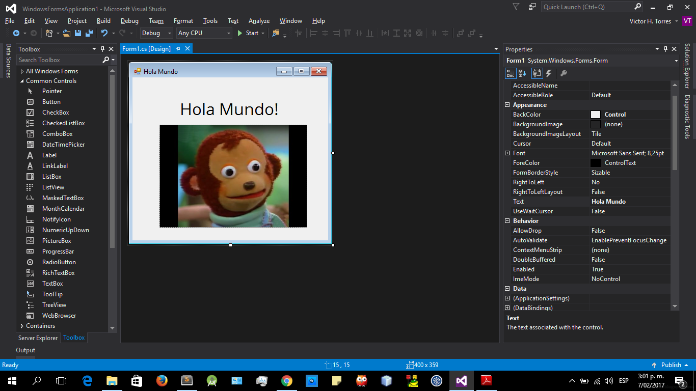
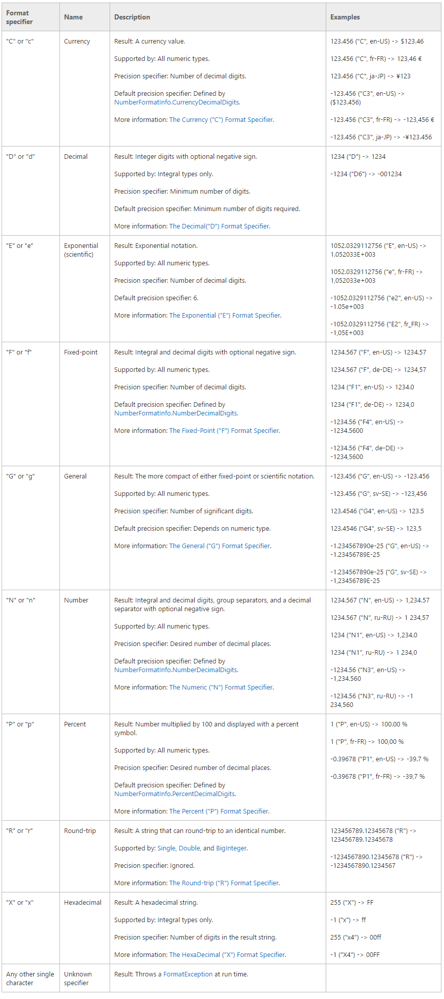
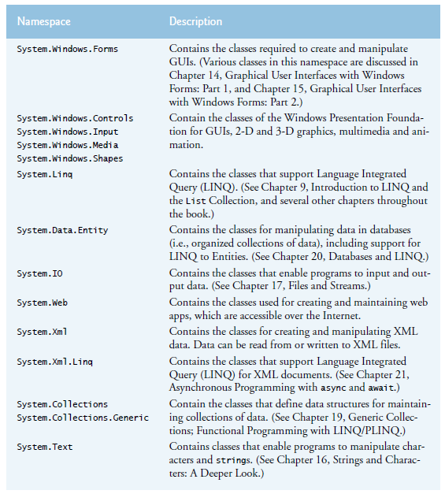

# C sharp

Referencias rápidas de la sintaxis y snippet sobre el lenguaje de programación c#.

## Tabla de contenido

- [Hola Mundo en consola](#hola-mundo-en-consola).
- [Hola Mundo en GUI](#hola-mundo-en-gui).
- [Tipos de datos](#tipos-de-datos).
- [Operadores](#operadores).
- [Comentarios](#comentarios).
- [Argumentos por posición](#argumentos-por-posicion).
- [Secuencias de escape](#secuencias-de-escape).
- [Variables de tipo constante](#variables-de-tipo-constante).
- [Interpolación de cadenas](#interpolacion-de-cadenas).
- [Formato de cadenas numéricas](#formato-de-cadenas-numericas)
- [Controles de flujo](#controles-de-flujo).
 - [if-else](#if-else).
 - [Operador condicional ternario](#operador-condicional-ternario).
 - [switch](#switch).
- [Instrucciones de bucle](#instrucciones-de-bucle).
 - [For](#for).
 - [Foreach](#foreach).
 - [While y do while](#while-y-do-while).
- [Propiedades implementadas automáticamente - Getter y Setter](#propiedades-setter-y-getter-automatico).
- [Los namespaces más utilizados en .NET Framework](#los-namespaces-mas-utilizados).
- [Enumeraciones](#enumeraciones).
- [Snippets](#snippets).
 - [Números aleatorios](#numeros-aleatorios).
- [Fuentes](#fuentes).


## Hola mundo en consola

Hola mundo por medio de consola.

Sintaxis:

```csharp

using System;

namespace HolaMundo
{
    class Program
    {
        static void Main(string[] args)
        {
            Console.WriteLine("Hola mundo!"); // Hola mundo!
            Console.ReadLine(); // Permite que el programa no termine, después de haber leído la linea anterior.
        }
    }
}

```

## Hola Mundo en GUI

En Visual Studio > File > New > Project > Windows Form Application



- Para agregar un texto en la ventana: View > Toolbox > opción Label > arrastrar a la ventana.
- Para agregar una imagen en la ventana: View > Toolbox > opción pictureBox > arrastrar a la ventana.

Para ver las propiedades de cada opción, se debe dar clic derecho encima de cada una en la ventana GUI y podrá personalizarlo.


## Tipos de datos


## Comentarios

Sintaxis:

```csharp

// Esto es un comentario de una linea.

/* Esto es un comentario
de más de una linea */

```

## Operadores

C# ofrece todos los operadores compatibles con Java aplicables, como se muestra en la tabla siguiente. Al final de la tabla, verá algunos operadores nuevos disponibles en C#, pero no en Java:


## Argumentos por posicion

Sintaxis:

```csharp

string cadena = "Mundo";

Console.WriteLine("Hola {0}", cadena);

// Hola Mundo

```
El {0} define la posición del argumento para reemplazarlo por el valor que tenga dicha variable.

## Secuencias de escape

| Secuencia de escape | Descripción |
| ----- | ---- |
| `\n` | Nueva linea |
| `\t` | Tab |
| `\"` | Doble cita. Se utiliza para colocar un carácter de comillas dobles (") en una cadena. |
| `\n` | Retorno de carro |
| `\\` | Para poner blackslash en la cadena |

## Variables de tipo constante

En C# utiliza la palabra clave `const`. Además de const, C# proporciona la palabra clave `readonly` para declarar variables a las que se puede asignar un valor una vez en tiempo de ejecución, ya sea en la instrucción de declaración o en otra parte del constructor. Después de la inicialización, el valor de una variable readonly no puede cambiar.

## Interpolacion de cadenas

Consiste en introducir valores de variables o expresiones en el interior de cadenas.

Sintaxis:

```csharp

string nombre = "Victor";

Console.WriteLine($"Hola {nombre}!");

// Hola Victor!

```

## Formato de cadenas numericas



Ejemplo 1:

```csharp

decimal value = 123.456m;
Console.WriteLine(value.ToString("C2"));
// $123.46

```
Ejemplo 2:

```csharp

decimal value = 123.456m;
Console.WriteLine("Your account balance is {0:C2}.", value);
// Your account balance is $123.46.

```

## Controles de flujo

Las instrucciones de control de flujo, como if else y switch, son muy similares en Java y C#.

### if-else

Estas instrucciones son idénticas en ambos lenguajes.

Sintaxis:

```csharp

if(condición){
	// bloque de código
}


if(condición){
	// bloque de código
}else{
	// bloque de código
}


if(condición){
	// bloque de código
}else if(condición){
	// bloque de código
}else{
	// bloque de código
}

```

### Operador condicional ternario

Devuelve una de dos expresiones, dependiendo de una condición.

Sintaxis:

`condicion booleana ? acción si es verdadera : acción si es falso `

Ejemplo:

```csharp

var now = new Date();
var greeting = "Good" + ((now.getHours() > 17) ? " evening." : " day.");

```

### Switch

C# exige el uso de una instrucción break o goto al final de cada caso y, si no hay ninguna presente, el compilador produce el siguiente error: El control no puede pasar explícitamente de una etiqueta de caso a otra.

Se debe tener en cuenta que donde un caso no especifica un código para ejecutar cuando coincide ese caso, el control pasará al caso siguiente.

Ejemplo:

```csharp

static void Main(string[] args)
{
    switch (args[0])
    {
        case "copy":
            //...
            break;

        case "move":
            //...
            goto case "delete";

        case "del":
        case "remove":
        case "delete":
            //...
            break;

        default:
            //...
            break;
    }
}

```

## Instrucciones de bucle

La sintaxis y el funcionamiento de los bucles for son iguales en C# y Java.

### For

Ejemplo:

```csharp

for (int i = 0; i<=9; i++)
{
    System.Console.WriteLine(i);
}

```

### Foreach

C# introduce un nuevo tipo de bucle denominado bucle foreach. El bucle foreach permite la iteración a través de cada elemento en una clase contenedora, como una matriz, que admite la interfaz `IEnumerable`. El código siguiente muestra el uso de la instrucción foreach para obtener el contenido de una matriz:

```csharp

static void Main()
{
    string[] arr= new string[] {"Jan", "Feb", "Mar"};

    foreach (string s in arr)
    {
        System.Console.WriteLine(s);
    }
}

```

### While y do while

La sintaxis y el funcionamiento de las instrucciones while y do...while son iguales en ambos lenguajes.

Sintaxis:

```csharp

while (condition)
{
    // statements
}

```

Sintaxis:

```csharp

do
{
    // statements
}
while(condition);  // Don't forget the trailing ; in do...while loops

```

## Propiedades setter y getter automatico

Ejemplo:

```csharp

	// This class is mutable. Its data can be modified from
    // outside the class.
    class Customer
    {
        // Auto-Impl Properties for trivial get and set
        public double TotalPurchases { get; set; }
        public string Name { get; set; }
        public int CustomerID { get; set; }

        // Constructor
        public Customer(double purchases, string name, int ID)
        {
            TotalPurchases = purchases;
            Name = name;
            CustomerID = ID;
        }
        // Methods
        public string GetContactInfo() {return "ContactInfo";}
        public string GetTransactionHistory() {return "History";}

        // .. Additional methods, events, etc.
    }
    
    class Program
    {
        static void Main()
        {
            // Intialize a new object.
            Customer cust1 = new Customer ( 4987.63, "Northwind",90108 );

            //Modify a property
            cust1.TotalPurchases += 499.99;
        }
    }

```

También, puedes auto-implementar las propiedades:

```csharp

public string FirstName { get; set; } = "Jane"; 

```


Si necesitas código extra en las propiedades:

```csharp

public class Date
        {
            private int month = 7;  // Backing store

            public int Month
            {
                get
                {
                    return month;
                }
                set
                {
                    if ((value > 0) && (value < 13))
                    {
                        month = value;
                    }
                }
            }
        }

```

## Los namespaces mas utilizados



## Enumeraciones

La palabra clave `enum` se utiliza para declarar una enumeración, un tipo distinto que consiste en un conjunto de constantes nombradas denominadas enumerador.

Sintaxis:

```csharp

enum <nombreEnum> : <tipoBase>
 {
  <constantes>
 } 

```
- nombreEnum: Un nombre para definir el conjunto de las constantes.
- tipoBase: El tipo de valores que podrán tomar las constantes, ejemplo: int, short, byte, etc...


Ejemplo

```csharp

enum Days : byte {Sat=1, Sun, Mon, Tue, Wed, Thu, Fri};

```

Si no se inicializa una constante, entonces arrancan desde cero.

## Snippets

Algunos pedazos de códigos reutilizables.

### Numeros aleatorios

```csharp

using System;

class RandomIntegers
{
    static void Main()
    {
        // loop 20 times
        for (int counter = 1; counter <= 20; ++counter)
        {
            // pick random integer from 1 to 6
            int number = randomNumbers.Next(1, 7);
            Console.Write($"{number} "); // display generated value
        }

        Console.WriteLine();
    }
}

```

## Fuentes

- [Csharp para desarrolladores java](https://msdn.microsoft.com/es-es/library/ms228358(v=vs.90).aspx).
- [How to program in c#](http://www.deitel.com/Books/C/VisualCHowtoProgram6e/tabid/3680/Default.aspx).