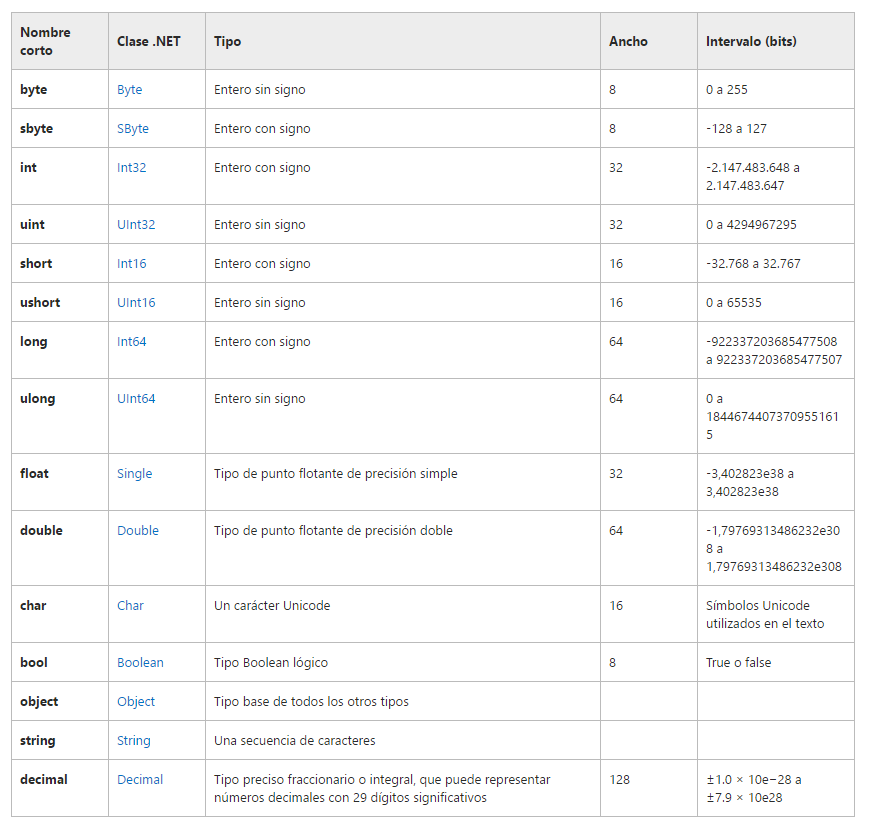
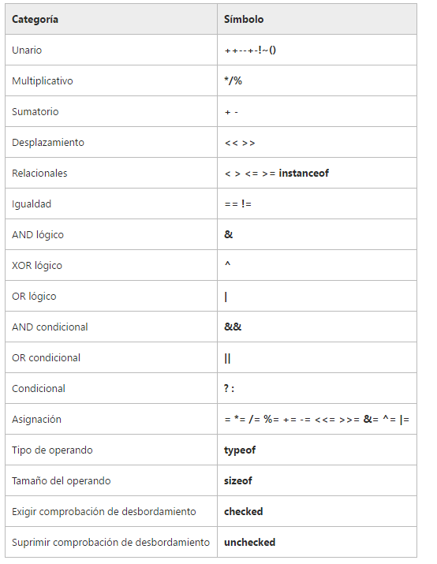

# C sharp

Referencias rápidas de la sintaxis y snippet sobre el lenguaje de programación c#.

## Tabla de contenido

- [Hola Mundo](#hola-mundo).
- [Tipos de datos](#tipos-de-datos).
- [Operadores](#operadores).
- [Comentarios](#comentarios).
- [Argumentos por posición](#argumentos-por-posicion).
- [Variables de tipo constante](#variables-de-tipo-constante).
- [Controles de flujo](#controles-de-flujo).
 - [if-else](#if-else).
 - [switch](#switch).
- [Instrucciones de bucle](#instrucciones-de-bucle).
 - [For](#for).
 - [Foreach](#foreach).
 - [While y do while](#while-y-do-while).


## Hola mundo

Hola mundo por medio de consola.

Sintaxis:

```csharp

using System;

namespace HolaMundo
{
    class Program
    {
        static void Main(string[] args)
        {
            Console.WriteLine("Hola mundo!"); // Hola mundo!
            Console.ReadLine(); // Permite que el programa no termine, después de haber leído la linea anterior.
        }
    }
}

```

## Tipos de datos




## Comentarios

Sintaxis:

```csharp

// Esto es un comentario de una linea.

/* Esto es un comentario
de más de una linea */

```

## Operadores

C# ofrece todos los operadores compatibles con Java aplicables, como se muestra en la tabla siguiente. Al final de la tabla, verá algunos operadores nuevos disponibles en C#, pero no en Java:



## Argumentos por posicion

Sintaxis:

```csharp

string cadena = "Mundo";

Console.WriteLine("Hola {0}", cadena);

// Hola Mundo

```
El {0} define la posición del argumento para reemplazarlo por el valor que tenga dicha variable.

## Variables de tipo constante

 En C# utiliza la palabra clave `const`. Además de const, C# proporciona la palabra clave `readonly` para declarar variables a las que se puede asignar un valor una vez en tiempo de ejecución, ya sea en la instrucción de declaración o en otra parte del constructor. Después de la inicialización, el valor de una variable readonly no puede cambiar.

## Controles de flujo

Las instrucciones de control de flujo, como if else y switch, son muy similares en Java y C#.

### if-else

Estas instrucciones son idénticas en ambos lenguajes.

Sintaxis:

```csharp

if(condición){
	// bloque de código
}


if(condición){
	// bloque de código
}else{
	// bloque de código
}


if(condición){
	// bloque de código
}else if(condición){
	// bloque de código
}else{
	// bloque de código
}

```

### Switch

C# exige el uso de una instrucción break o goto al final de cada caso y, si no hay ninguna presente, el compilador produce el siguiente error: El control no puede pasar explícitamente de una etiqueta de caso a otra.

Se debe tener en cuenta que donde un caso no especifica un código para ejecutar cuando coincide ese caso, el control pasará al caso siguiente.

Ejemplo:

```csharp

static void Main(string[] args)
{
    switch (args[0])
    {
        case "copy":
            //...
            break;

        case "move":
            //...
            goto case "delete";

        case "del":
        case "remove":
        case "delete":
            //...
            break;

        default:
            //...
            break;
    }
}

```

## Instrucciones de bucle

La sintaxis y el funcionamiento de los bucles for son iguales en C# y Java.

### For

Ejemplo:

```csharp

for (int i = 0; i<=9; i++)
{
    System.Console.WriteLine(i);
}

```

### Foreach

C# introduce un nuevo tipo de bucle denominado bucle foreach. El bucle foreach permite la iteración a través de cada elemento en una clase contenedora, como una matriz, que admite la interfaz `IEnumerable`. El código siguiente muestra el uso de la instrucción foreach para obtener el contenido de una matriz:

```csharp

static void Main()
{
    string[] arr= new string[] {"Jan", "Feb", "Mar"};

    foreach (string s in arr)
    {
        System.Console.WriteLine(s);
    }
}

```

### While y do while

La sintaxis y el funcionamiento de las instrucciones while y do...while son iguales en ambos lenguajes.

Sintaxis:

```csharp

while (condition)
{
    // statements
}

```

Sintaxis:

```csharp

do
{
    // statements
}
while(condition);  // Don't forget the trailing ; in do...while loops

```